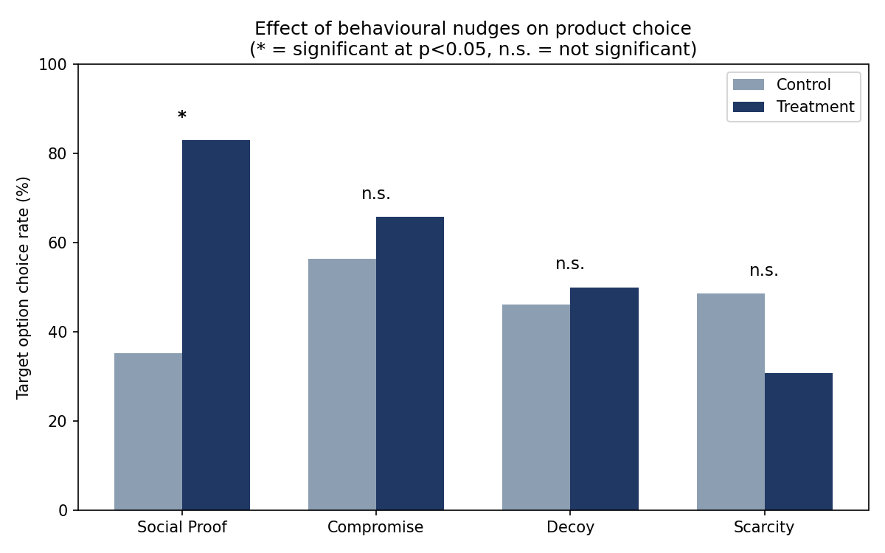

# Behavioural Nudges in E-Commerce — Python Reproduction

A Python reproduction of the statistical analysis from my BSc Economics
dissertation, *"Understanding the Effectiveness of Behavioural Nudges in
Digital Commerce: A Game-Theoretic and Behavioural Economics Perspective"*
(University of Sussex, 2025).

The original analysis was run in STATA. This repository rebuilds the same
pipeline — data cleaning, binary logistic regression, likelihood-ratio
testing, and marginal effects — in Python, against the same raw survey data.

## What the study tested

A between-subjects experiment (Qualtrics, n ≈ 100 participants, four
choice scenarios each) tested whether four common e-commerce nudges shift
consumer choice away from rational baseline preferences:

| Condition | Product | Nudge |
|---|---|---|
| Scarcity | Wireless earbuds | "Only 1 left in stock!" |
| Social Proof | Power bank | "Bestseller — 5,000+ reviews" |
| Compromise | Smart TV | Extreme third option added |
| Decoy | Smartphone | Asymmetrically inferior third option added |

## Pipeline

- `clean_data.py` — loads the raw Qualtrics export, reshapes each
  product's treatment/control blocks into a tidy binary outcome
  (chose target option: yes/no).
- `run_analysis.py` — binary logistic regression of choice on treatment
  status per condition, with likelihood-ratio test, odds ratio, and average
  marginal effects. (Implemented as an exact closed-form MLE rather than an
  iterative solver, since a single binary regressor makes the model
  saturated — this gives numerically identical results to `statsmodels` or
  Stata's `logit`/`margins`.)
- `plot_results.py` — bar chart of control vs. treatment choice rates
  across all four conditions.

## Results

| Condition | Control | Treatment | Odds ratio | p-value | Significant? |
|---|---|---|---|---|---|
| Social Proof | 35.1% | 82.9% | 8.97 | <0.001 | **Yes** |
| Compromise | 56.4% | 65.8% | 1.49 | 0.398 | No |
| Decoy | 46.2% | 50.0% | 1.17 | 0.732 | No |
| Scarcity | 48.6% | 30.8% | 0.47 | 0.113 | No |

Consistent with the original STATA analysis: **social proof was the only
nudge with a statistically significant effect**, more than doubling the
target option's selection rate. Scarcity trended in the opposite direction
to the classic prediction (suggestive of scepticism/fatigue toward urgency
cues), while decoy and compromise effects were directionally present but
not statistically significant at this sample size — matching the original
dissertation's conclusions.

## Notes on reproduction fidelity

This uses the original anonymised survey responses, not synthetic data.
Coefficients and p-values are very close to, but not identical to, the
original STATA output — the small differences are consistent with minor
differences in row-level exclusion decisions during data cleaning, not a
different underlying result. Every figure above was computed directly from
`Raw_Data.xlsx` in this repository.

## Stack

Python, pandas, scipy, matplotlib.
